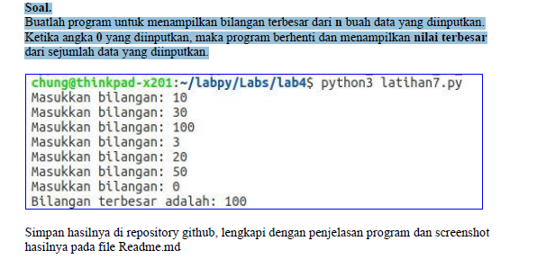
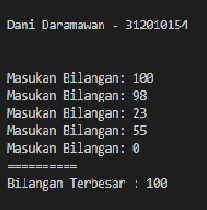

# UTS susulan
Repository ini digunakan untuk memenuhi UTS susulan Pemrograman

Nama    : Dani Darmawan <br>
NIM     : 312010154 <br>
KELAS   : TI.20.B1 <br>

* Soal UTS susulan


Input
``` python
n=[]
o = False

while(not o):
    bil = int(input("Masukan Bilangan: "))
    n.append(bil)
    
    if bil == 0 :
        o = True
 

print("=" * 10 )
print("Bilangan Terbesar :",max(n))
```
Hasilnya



disini saya menggunakan fungsi **while** untuk perulangan<br>
``` python
while(not o):
    bil = int(input("Masukan Bilangan: "))

```
funngsi dari penggunan **if** di bawah ini agar jika kita memasukan angka 0 akan berhenti dan selain 0 akan<br>
berlanjut terus<br>

``` python
 if bil == 0 :
        o = True

```
dan terakhir , cara agar yang di tampilakn hanya bilangan terbesarnya saja tinggal tambahkan fungsi **max()**<br>
seperti pada syntax di bawah ini<br>
``` python
print("Bilangan Terbesar :",max(n))